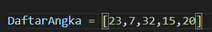
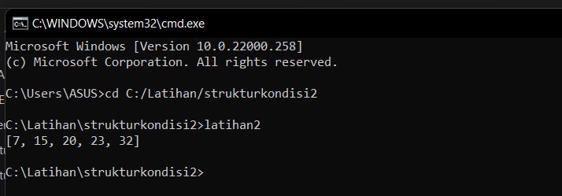

# Latihan2
## Membuat program mengurutkan data
### selection_sort

### Oke jadi disini saya buat program menggunakan selection_sort
dan membrikan contoh angka seperti ini 

jadi kita akan mengurutkan dari angka terkecil

### Maka hasilnya akan seperti ini

## Sekian dari saya terima kasih

